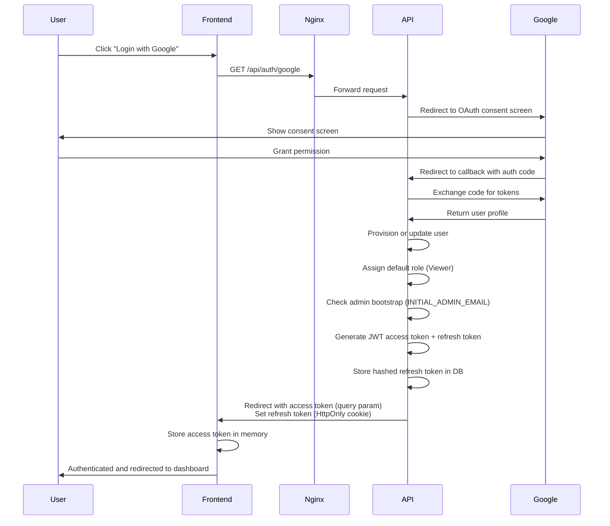
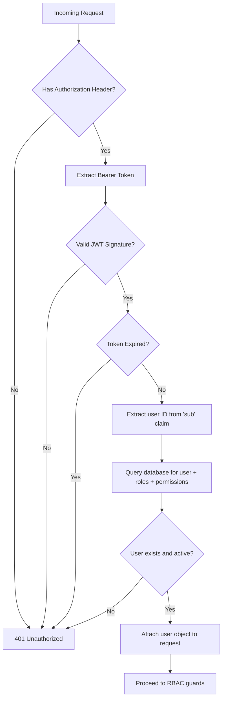
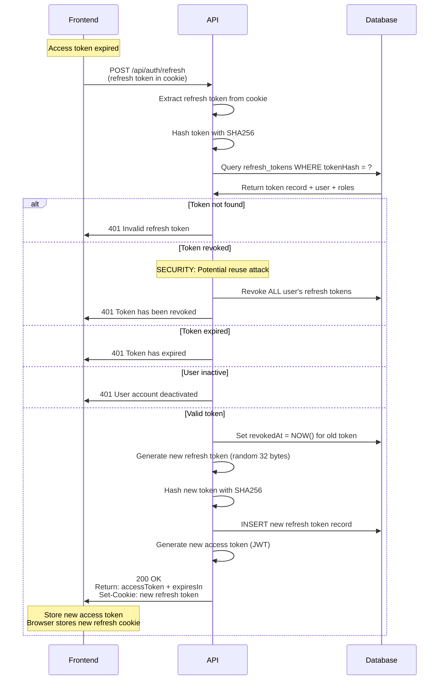
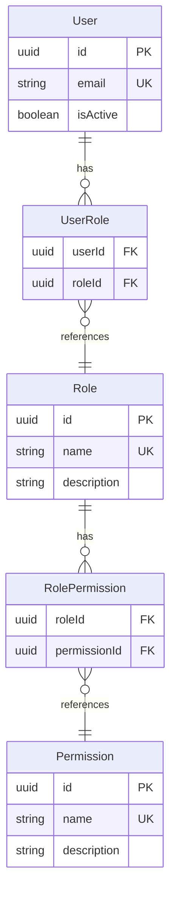
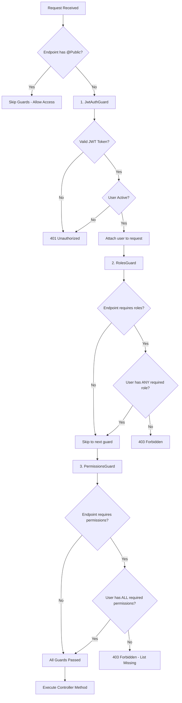
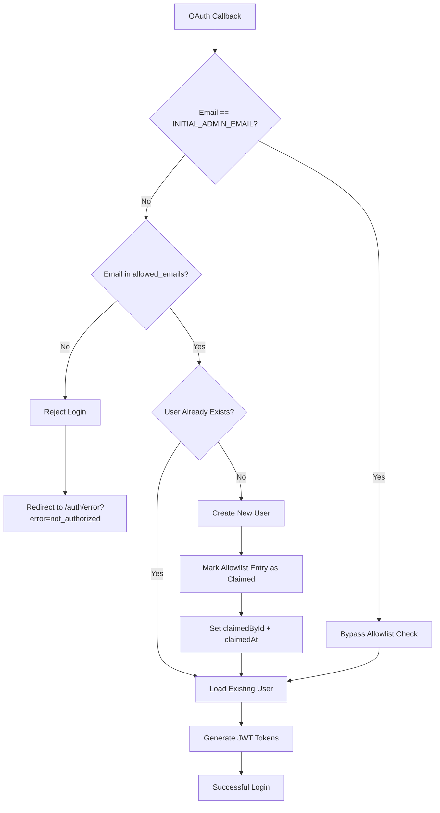
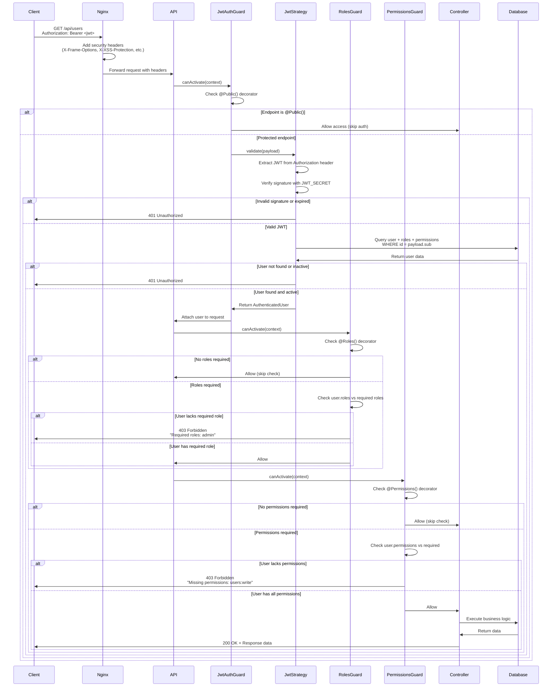
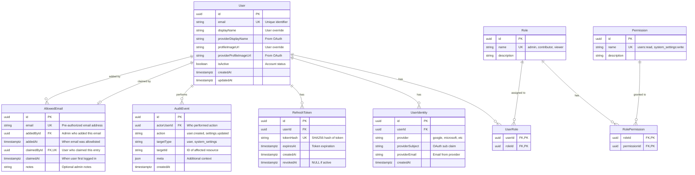

# Security Architecture

## Executive Summary

This document provides a comprehensive overview of the security architecture for the Enterprise Application Foundation. The system implements defense-in-depth security through multiple layers: OAuth 2.0 authentication with Google, JWT-based session management with token rotation, email allowlist access control, Role-Based Access Control (RBAC), and comprehensive audit logging.

**Key Security Technologies:**
- **Authentication**: OAuth 2.0 / OpenID Connect (Google)
- **Access Control**: Email allowlist restricts access to pre-authorized users
- **Session Management**: JWT access tokens + HttpOnly refresh tokens with rotation
- **Authorization**: Role-Based Access Control (RBAC) with three roles (Admin, Contributor, Viewer)
- **Token Storage**: SHA256 hashed refresh tokens in PostgreSQL
- **Infrastructure**: Nginx reverse proxy with security headers
- **Audit**: Comprehensive event logging for all security-relevant actions

**Security Posture**: Production-grade security suitable for enterprise applications handling sensitive user data.

---

## 1. Authentication Architecture

### OAuth 2.0 Flow with Google

The application uses OAuth 2.0 with OpenID Connect for authentication. All user authentication flows through Google's OAuth service, eliminating the need to store or manage passwords.



**OAuth Endpoints:**
- `GET /api/auth/google` - Initiates OAuth flow, redirects to Google
- `GET /api/auth/google/callback` - Handles OAuth callback, provisions user, returns tokens

**User Provisioning Logic:**
1. **Allowlist check**: Verify email is in `allowed_emails` table (or matches `INITIAL_ADMIN_EMAIL`)
2. If not in allowlist, reject login with "Email not authorized" error
3. Check if user identity exists (provider + subject)
4. If not, check if user exists by email (identity linking)
5. If neither, create new user with:
   - Default role: `viewer`
   - Default user settings (theme, locale)
   - Linked OAuth identity
   - Mark allowlist entry as claimed (`claimedById`, `claimedAt`)
6. Check if user email matches `INITIAL_ADMIN_EMAIL`
7. If match and no other admins exist, grant admin role
8. Update provider profile information (display name, profile image)
9. Generate JWT tokens

**Allowlist Security:**
- Only admins can add/remove emails from the allowlist
- The `INITIAL_ADMIN_EMAIL` bypasses allowlist check (bootstrap access)
- Allowlist entries that have been claimed cannot be removed (prevents accidentally removing existing user access)
- All allowlist operations are audit logged

### JWT Token Structure

**Access Token Payload:**
```json
{
  "sub": "user-uuid",
  "email": "user@example.com",
  "roles": ["viewer"],
  "iat": 1706123456,
  "exp": 1706124356
}
```

**Token Signing:**
- Algorithm: HS256 (HMAC with SHA-256)
- Secret: `JWT_SECRET` environment variable (minimum 32 characters)
- Signature validates token integrity and authenticity

**Token Validation Process:**


**Access Token Validation (JWT Strategy):**
- Verify signature using `JWT_SECRET`
- Check expiration (`exp` claim)
- Extract user ID from `sub` claim
- Load user from database with roles and permissions
- Validate user is active (`isActive = true`)
- Attach full user object to request for downstream guards

---

## 2. Token Management

### Access Tokens vs Refresh Tokens

| Aspect | Access Token | Refresh Token |
|--------|--------------|---------------|
| **Type** | JWT (signed JSON) | Random 32-byte hex string |
| **Storage (Client)** | Memory only (never localStorage) | HttpOnly cookie |
| **Storage (Server)** | None (stateless) | SHA256 hash in `refresh_tokens` table |
| **Lifetime** | 15 minutes (default) | 14 days (default) |
| **Purpose** | Authorize API requests | Obtain new access tokens |
| **Exposed to JS** | Yes (needed for Authorization header) | No (HttpOnly prevents access) |
| **Revocable** | No (stateless, valid until expiry) | Yes (database record can be revoked) |
| **Rotation** | New token on each refresh | New token on each refresh (old one revoked) |
| **Attack Surface** | XSS (if stored in localStorage) | CSRF (mitigated by SameSite) |

**Why This Design:**
- **Short-lived access tokens** minimize damage from token theft (15 min window)
- **HttpOnly cookies** protect refresh tokens from XSS attacks
- **Token rotation** limits refresh token reuse and enables reuse detection
- **Database storage** allows server-side revocation (logout, security breach)

### Token Rotation Mechanism

Refresh tokens are rotated on every use to detect token theft and limit the impact of compromised tokens.



**Rotation Benefits:**
1. **Reuse Detection**: If a revoked token is used, all tokens are invalidated (indicates theft)
2. **Limit Exposure**: Each token is single-use, limiting replay attack window
3. **Audit Trail**: Each refresh creates a database record for security monitoring

### Token Reuse Detection

The system implements refresh token reuse detection to identify potential token theft:

**Attack Scenario:**
1. Attacker steals refresh token from victim
2. Victim uses token normally (rotates to new token)
3. Attacker attempts to use old (revoked) token

**Detection & Response:**
```typescript
// Check if token is revoked
if (storedToken.revokedAt) {
  // SECURITY ALERT: Revoked token used - likely token theft
  await this.revokeAllUserTokens(storedToken.userId);
  logger.warn(`Refresh token reuse detected for user: ${userId}`);
  throw new UnauthorizedException('Refresh token has been revoked');
}
```

When a revoked token is used, the system:
1. **Revokes all refresh tokens** for that user across all devices
2. **Logs a security warning** for monitoring and alerting
3. **Forces re-authentication** on all sessions

This aggressive response ensures that if a token is stolen, the attacker's window is minimized and legitimate users are forced to re-authenticate.

### Cookie Security Settings

Refresh tokens are stored in HttpOnly cookies with strict security settings:

```typescript
const COOKIE_OPTIONS = {
  httpOnly: true,                          // Prevents JavaScript access
  secure: process.env.NODE_ENV === 'production', // HTTPS only in production
  sameSite: 'lax' as const,               // CSRF protection
  path: '/api/auth',                      // Limit scope to auth endpoints
  maxAge: 14 * 24 * 60 * 60 * 1000,      // 14 days in milliseconds
};
```

| Setting | Value | Purpose |
|---------|-------|---------|
| `httpOnly` | `true` | Prevents XSS attacks - JavaScript cannot read cookie |
| `secure` | `true` (prod) | Requires HTTPS - prevents MITM attacks |
| `sameSite` | `lax` | CSRF protection - blocks cross-site POST requests |
| `path` | `/api/auth` | Minimizes cookie scope - only sent to auth endpoints |
| `maxAge` | 14 days | Auto-expires after 14 days |

**SameSite Policy Explanation:**
- `lax`: Cookie sent on same-site requests and top-level navigation (safe GET)
- Blocks cookie on cross-site POST/PUT/DELETE (prevents CSRF on token refresh)
- Allows OAuth redirect callbacks (same-site navigation)

### Token Cleanup Task

Expired and revoked refresh tokens are automatically cleaned up to reduce database size:

```typescript
@Cron(CronExpression.EVERY_DAY_AT_3AM)
async handleCron() {
  const count = await this.authService.cleanupExpiredTokens();
  logger.log(`Token cleanup: ${count} tokens removed`);
}
```

**Cleanup Logic:**
- Runs daily at 3:00 AM
- Deletes tokens where:
  - `expiresAt < NOW()` (expired)
  - `revokedAt IS NOT NULL` (revoked)
- Removes sensitive data from database
- Improves query performance

---

## 3. Authorization & RBAC

### Roles and Permissions Model

The system implements a flexible Role-Based Access Control (RBAC) model with three predefined roles:



### Permissions Matrix

| Permission | Description | Admin | Contributor | Viewer |
|------------|-------------|-------|-------------|--------|
| `system_settings:read` | View system-wide settings | ✅ | ❌ | ❌ |
| `system_settings:write` | Modify system-wide settings | ✅ | ❌ | ❌ |
| `users:read` | View user list and details | ✅ | ❌ | ❌ |
| `users:write` | Modify user accounts (activate/deactivate, assign roles) | ✅ | ❌ | ❌ |
| `rbac:manage` | Assign roles to users | ✅ | ❌ | ❌ |
| `allowlist:read` | View allowlisted email addresses | ✅ | ❌ | ❌ |
| `allowlist:write` | Add/remove emails from allowlist | ✅ | ❌ | ❌ |
| `user_settings:read` | View own user settings | ✅ | ✅ | ✅ |
| `user_settings:write` | Modify own user settings | ✅ | ✅ | ✅ |

**Role Descriptions:**
- **Admin**: Full system access - manage users, roles, and all settings
- **Contributor**: Standard user capabilities - manage own settings (ready for future feature expansion)
- **Viewer**: Read-only access - minimal privileges, manage own settings (default role for new users)

**Default Role Assignment:**
- New users are assigned the `viewer` role automatically
- First user matching `INITIAL_ADMIN_EMAIL` receives `admin` role (bootstrap)
- Additional roles can be assigned by admins via `/api/users/{id}` endpoint

### Guard Execution Flow

The authorization system uses three guards that execute in sequence:



**Guard Logic:**

1. **JwtAuthGuard** (Global, Required by default)
   - Checks for `@Public()` decorator - if present, skip all auth
   - Validates JWT token from `Authorization: Bearer <token>` header
   - Loads user with roles and permissions from database
   - Verifies user is active
   - Attaches `AuthenticatedUser` object to `request.user`

2. **RolesGuard** (OR Logic)
   - Checks for `@Roles()` decorator - if absent, allow access
   - Extracts required roles from decorator metadata
   - Checks if user has **ANY** of the required roles
   - Returns 403 if user lacks all required roles
   - Example: `@Roles('admin', 'contributor')` - user needs admin OR contributor

3. **PermissionsGuard** (AND Logic)
   - Checks for `@Permissions()` decorator - if absent, allow access
   - Extracts required permissions from decorator metadata
   - Checks if user has **ALL** required permissions
   - Returns 403 with list of missing permissions if check fails
   - Example: `@Permissions('users:read', 'users:write')` - user needs BOTH

**Why OR for Roles but AND for Permissions?**
- **Roles** are broad categories - "any admin or contributor can access"
- **Permissions** are specific capabilities - "needs both read AND write"
- This provides flexibility: `@Auth({ roles: ['admin'], permissions: ['system_settings:write'] })`

### Using Authorization Decorators

**Combined `@Auth()` Decorator (Recommended):**
```typescript
import { Auth } from './auth/decorators';
import { ROLES, PERMISSIONS } from './common/constants/roles.constants';

// Just authentication, no role/permission requirements
@Auth()
@Get('profile')
async getProfile(@CurrentUser() user: RequestUser) { }

// Require admin role
@Auth({ roles: [ROLES.ADMIN] })
@Get('users')
async listUsers() { }

// Require specific permissions
@Auth({ permissions: [PERMISSIONS.SYSTEM_SETTINGS_WRITE] })
@Patch('system-settings')
async updateSystemSettings() { }

// Combine roles and permissions
@Auth({
  roles: [ROLES.ADMIN],
  permissions: [PERMISSIONS.USERS_WRITE]
})
@Patch('users/:id')
async updateUser() { }
```

**Individual Decorators:**
```typescript
import { UseGuards } from '@nestjs/common';
import { JwtAuthGuard, RolesGuard } from './auth/guards';
import { Roles } from './auth/decorators';

@UseGuards(JwtAuthGuard, RolesGuard)
@Roles('admin', 'contributor')
@Get('dashboard')
async getDashboard() { }
```

**Public Endpoints:**
```typescript
import { Public } from './auth/decorators';

@Public()
@Get('auth/providers')
async getProviders() {
  // No authentication required
}
```

---

## 4. Email Allowlist Access Control

### Overview

The application implements an **email allowlist** as an additional security layer to restrict access to pre-authorized users only. This feature prevents unauthorized users from gaining access even if they successfully authenticate via OAuth.

**Security Benefits:**
- Prevents open registration - only invited users can access the application
- Provides administrative control over who can login
- Tracks when allowlist entries are claimed (first login)
- Prevents accidental removal of access for existing users

### Allowlist Enforcement Flow



### Allowlist Table Schema

```typescript
model AllowedEmail {
  id          String    @id @default(uuid())
  email       String    @unique              // Pre-authorized email
  addedById   String?                        // Admin who added this
  addedAt     DateTime  @default(now())      // When it was allowlisted
  claimedById String?   @unique              // User who claimed it
  claimedAt   DateTime?                      // When user first logged in
  notes       String?                        // Optional admin notes
}
```

**Key Fields:**
- `email` - Unique constraint ensures no duplicates
- `claimedById` - Unique constraint (one user per allowlist entry)
- `claimedAt` - Null = pending, populated = claimed

### Status Types

| Status | Description | claimedById | claimedAt |
|--------|-------------|-------------|-----------|
| **Pending** | Email added but user hasn't logged in yet | `null` | `null` |
| **Claimed** | User has successfully logged in | User ID | Timestamp |

### Admin Operations

#### Add Email to Allowlist

**Endpoint:** `POST /api/allowlist`

**Permission Required:** `allowlist:write` (Admin only)

**Request:**
```json
{
  "email": "newuser@example.com",
  "notes": "New team member starting next week"
}
```

**Business Logic:**
1. Validate email format
2. Check for duplicates (return 409 if exists)
3. Create allowlist entry with `addedById` = current admin
4. Audit log the addition

**Use Case:** Admins pre-authorize users before they attempt their first login.

---

#### Remove Email from Allowlist

**Endpoint:** `DELETE /api/allowlist/:id`

**Permission Required:** `allowlist:write` (Admin only)

**Validation:**
- ✅ Can remove if `claimedById` is `null` (pending entry)
- ❌ Cannot remove if `claimedById` is populated (claimed entry)

**Rationale:** Prevents admins from accidentally removing access for existing users. To revoke access for existing users, use the user deactivation feature instead (`PATCH /api/users/:id` with `isActive: false`).

**Business Logic:**
1. Check if entry is claimed
2. If claimed, return 400 Bad Request with error message
3. If pending, delete entry
4. Audit log the removal

---

#### List Allowlist Entries

**Endpoint:** `GET /api/allowlist`

**Permission Required:** `allowlist:read` (Admin only)

**Query Parameters:**
- `status` - Filter by: `all`, `pending`, `claimed`
- `search` - Search by email
- `sortBy` - Sort by: `email`, `addedAt`, `claimedAt`
- `sortOrder` - Order: `asc`, `desc`

**Response Includes:**
- Email address
- Status (pending/claimed)
- Admin who added it
- When it was added
- User who claimed it (if claimed)
- When it was claimed (if claimed)
- Optional notes

### Bootstrap Admin Bypass

The `INITIAL_ADMIN_EMAIL` environment variable provides a special bypass to enable the first admin to login without being pre-added to the allowlist.

**Bootstrap Logic:**
```typescript
async validateOAuthUser(profile: OAuthProfile) {
  const email = profile.email;

  // Special case: initial admin bypasses allowlist
  if (email === process.env.INITIAL_ADMIN_EMAIL) {
    // Allow login without allowlist check
    return this.provisionUser(profile);
  }

  // Check allowlist for all other users
  const allowlistEntry = await this.allowlistService.findByEmail(email);
  if (!allowlistEntry) {
    throw new UnauthorizedException('Email not authorized');
  }

  return this.provisionUser(profile);
}
```

**Why This is Secure:**
- The admin must have access to the `.env` file (server access)
- Only one email bypasses the check
- After initial admin logs in, they can add other users to the allowlist
- The initial admin email is automatically added to the allowlist during database seeding

### Integration with User Provisioning

When a user with a allowlisted email successfully authenticates:

1. **Check allowlist** before user provisioning
2. **Create user** if they don't exist
3. **Mark entry as claimed** by setting:
   - `claimedById` = new user's ID
   - `claimedAt` = current timestamp
4. **Update is idempotent** - if user logs in again, allowlist entry remains claimed

### Audit Trail

All allowlist operations are logged to the `audit_events` table:

| Action | Actor | Target | Description |
|--------|-------|--------|-------------|
| `allowlist.added` | Admin User ID | Allowlist Entry ID | Admin added email to allowlist |
| `allowlist.removed` | Admin User ID | Allowlist Entry ID | Admin removed pending entry |
| `allowlist.claimed` | User ID | Allowlist Entry ID | User claimed allowlist entry on first login |

### Security Considerations

**Protection Against:**
- ✅ Unauthorized access - Only allowlisted emails can login
- ✅ Open registration - No public signup, invitation-only
- ✅ Accidental removal - Cannot delete claimed entries

**Edge Cases Handled:**
- Email case-insensitivity (normalized to lowercase)
- Duplicate email prevention (unique constraint)
- Race condition on claim (unique constraint on claimedById)
- Orphaned allowlist entries (admin can clean up pending entries)

**Best Practices:**
- Add users to allowlist before sharing OAuth link
- Use notes field to track why user was allowlisted
- Regularly audit claimed vs pending entries
- Use user deactivation (`isActive: false`) instead of allowlist removal for revoking access

---

## 5. Request Lifecycle

### End-to-End Protected Request Flow

This diagram shows the complete security lifecycle of a protected API request:



**Security Checkpoints:**
1. **Nginx Layer**: Security headers, rate limiting (if configured)
2. **JWT Validation**: Signature, expiration, user exists and active
3. **Role Check**: User has required role (if specified)
4. **Permission Check**: User has all required permissions (if specified)
5. **Business Logic**: Controller executes with verified user context

**Request Object After Guards:**
```typescript
interface FastifyRequest {
  user: AuthenticatedUser;  // Full user object with relations
  requestUser: RequestUser; // Simplified user object
}

interface AuthenticatedUser {
  id: string;
  email: string;
  isActive: boolean;
  userRoles: Array<{
    role: {
      name: string;
      rolePermissions: Array<{
        permission: { name: string; }
      }>;
    };
  }>;
}

interface RequestUser {
  id: string;
  email: string;
  roles: string[];        // ['admin', 'viewer']
  permissions: string[];  // ['users:read', 'users:write', ...]
}
```

---

## 6. Database Security Model

### Security Tables ERD



**Table Descriptions:**

| Table | Purpose | Security Features |
|-------|---------|-------------------|
| `users` | Core user accounts | `isActive` flag for soft deletion, prevents auth |
| `user_identities` | OAuth provider links | `provider + providerSubject` unique constraint |
| `roles` | Role definitions | Seeded at deployment, rarely modified |
| `permissions` | Permission definitions | Seeded at deployment, rarely modified |
| `role_permissions` | Role-to-permission mapping | Defines RBAC matrix |
| `user_roles` | User role assignments | Modified by admins via API, cascade delete |
| `refresh_tokens` | Active refresh tokens | SHA256 hashed, includes revocation timestamp |
| `allowed_emails` | Email allowlist | Restricts access, tracks claim status, prevents removal if claimed |
| `audit_events` | Security audit log | Immutable log of all security events |

### Audit Logging

The `audit_events` table provides a comprehensive audit trail for compliance and security monitoring.

**Audited Events:**
- User account creation
- User role assignments/changes
- User activation/deactivation
- System settings modifications
- User settings modifications
- Allowlist email additions/removals
- Allowlist entry claims (when user first logs in)
- Authentication events (login, logout, token refresh)

**Audit Event Structure:**
```typescript
interface AuditEvent {
  id: string;
  actorUserId: string | null;  // null for system actions
  action: string;               // e.g., 'user.role_assigned'
  targetType: string;           // e.g., 'user', 'system_settings'
  targetId: string;             // ID of affected resource
  meta: Record<string, any>;    // Additional context (changes, IP, etc.)
  createdAt: Date;
}
```

**Example Audit Entries:**
```json
[
  {
    "action": "user.created",
    "actorUserId": null,
    "targetType": "user",
    "targetId": "uuid-123",
    "meta": {
      "email": "user@example.com",
      "provider": "google",
      "initialRole": "viewer"
    }
  },
  {
    "action": "user.role_assigned",
    "actorUserId": "admin-uuid",
    "targetType": "user",
    "targetId": "user-uuid",
    "meta": {
      "role": "admin",
      "previousRoles": ["viewer"]
    }
  }
]
```

**Indexed Fields** (for query performance):
- `actorUserId` - Find all actions by a user
- `targetType + targetId` - Find all events for a resource
- `createdAt` - Time-based queries and retention policies

---

## 7. File Storage Security

The storage system implements multiple layers of security to protect uploaded files and prevent unauthorized access.

### Upload Validation

All file uploads are validated before acceptance:

**MIME Type Validation:**
- Configurable allowlist of permitted file types
- Default: Common document and image formats
- Server-side validation (client-declared MIME type verified)
- Prevents upload of executable files and scripts

**File Size Limits:**
- Configurable maximum file size (default: 10GB)
- Enforced at both simple upload and multipart initialization
- Prevents storage abuse and DoS attacks
- Size validation before S3 upload begins

**Content Type Verification:**
- Validates that file content matches declared MIME type
- Uses magic number detection for common file types
- Prevents MIME type spoofing attacks

**Example Configuration:**
```typescript
STORAGE_MAX_FILE_SIZE=10737418240      // 10GB in bytes
STORAGE_ALLOWED_MIME_TYPES=application/pdf,image/jpeg,image/png,application/zip
```

### Access Control

The storage system enforces strict ownership and permission-based access:

**Owner-Only Access (Default):**
- Users can only access their own uploaded files
- Object queries filtered by `owner_id = current_user.id`
- Download URLs only generated for owned objects
- Delete operations restricted to owner

**Admin Override:**
- Users with `storage:delete_any` permission can access all objects
- Useful for moderation and content management
- All admin operations logged to audit trail

**Permission Model:**
| Permission | Description | Granted To |
|------------|-------------|------------|
| `storage:read` | View own storage objects | All authenticated users |
| `storage:write` | Upload and update own objects | All authenticated users |
| `storage:delete` | Delete own storage objects | All authenticated users |
| `storage:read_any` | View all storage objects | Admin |
| `storage:write_any` | Update any storage object | Admin |
| `storage:delete_any` | Delete any storage object | Admin |

**Ownership Validation Example:**
```typescript
// Controller method enforces ownership
async getObject(objectId: string, userId: string) {
  const object = await this.objectsService.findById(objectId);

  // Check ownership (or admin permission)
  if (object.ownerId !== userId && !user.hasPermission('storage:read_any')) {
    throw new ForbiddenException('Access denied');
  }

  return object;
}
```

### Signed URLs

The storage system uses time-limited presigned URLs for secure file access:

**Download URLs:**
- Generated via S3 presigned GET URLs
- Default expiration: 1 hour (3600 seconds)
- Configurable per-request via `expiresIn` parameter
- URLs cannot be reused after expiration
- No AWS credentials exposed to client

**Upload URLs (Multipart):**
- Generated via S3 presigned PUT URLs for each part
- Short expiration: 15 minutes per part
- One-time use: URL invalidated after part upload
- Direct-to-S3 upload (bypasses application server for performance)

**Security Properties:**
- URLs cryptographically signed by AWS credentials
- Tampering detected via signature validation
- Time-based expiration prevents long-lived access
- Scoped to specific S3 operation (GET or PUT)

**Example Presigned URL Generation:**
```typescript
async generateDownloadUrl(objectId: string, expiresIn = 3600): Promise<string> {
  const object = await this.findById(objectId);

  return this.storageProvider.getSignedDownloadUrl(
    object.storageKey,
    expiresIn,
  );
}
```

### S3 Security Configuration

**Recommended S3 Bucket Security Settings:**

**IAM Roles (Production):**
- Use EC2/ECS IAM roles instead of static credentials
- Principle of least privilege: grant only required S3 permissions
- Rotate credentials if using access keys

**Server-Side Encryption:**
```typescript
// Enable SSE-S3 (AWS-managed keys)
ServerSideEncryption: 'AES256'

// Or SSE-KMS (customer-managed keys)
ServerSideEncryption: 'aws:kms'
KMSKeyId: 'arn:aws:kms:region:account:key/key-id'
```

**Block Public Access:**
```json
{
  "BlockPublicAcls": true,
  "IgnorePublicAcls": true,
  "BlockPublicPolicy": true,
  "RestrictPublicBuckets": true
}
```

**Access Logging:**
- Enable S3 access logs for audit trail
- Log bucket: separate from application bucket
- Review logs for suspicious access patterns

**Versioning:**
- Enable versioning for accidental deletion protection
- Configure lifecycle policy to archive old versions

**CORS Configuration:**
```json
{
  "CORSRules": [
    {
      "AllowedOrigins": ["https://yourdomain.com"],
      "AllowedMethods": ["PUT"],
      "AllowedHeaders": ["*"],
      "MaxAgeSeconds": 3000
    }
  ]
}
```

**Bucket Policy Example:**
```json
{
  "Version": "2012-10-17",
  "Statement": [
    {
      "Effect": "Deny",
      "Principal": "*",
      "Action": "s3:*",
      "Resource": "arn:aws:s3:::bucket-name/*",
      "Condition": {
        "Bool": { "aws:SecureTransport": "false" }
      }
    }
  ]
}
```

### Audit Logging

All storage operations are logged to the `audit_events` table for security monitoring and compliance:

**Logged Events:**

| Event | Action | Description |
|-------|--------|-------------|
| Upload Started | `storage:upload:init` | Multipart upload initialized |
| Upload Completed | `storage:upload:complete` | File upload finalized successfully |
| Upload Aborted | `storage:upload:abort` | Upload cancelled by user or system |
| Object Downloaded | `storage:object:download` | Download URL generated |
| Object Deleted | `storage:object:delete` | Object and file removed |
| Metadata Updated | `storage:object:metadata:update` | Custom metadata modified |

**Audit Event Structure:**
```typescript
{
  actorUserId: 'user-uuid',
  action: 'storage:upload:complete',
  targetType: 'storage_object',
  targetId: 'object-uuid',
  meta: {
    objectName: 'document.pdf',
    size: 1048576,
    mimeType: 'application/pdf',
    storageProvider: 's3',
    ipAddress: '192.168.1.1',
    userAgent: 'Mozilla/5.0...'
  },
  createdAt: '2024-01-01T12:00:00Z'
}
```

**Monitoring Queries:**
```sql
-- Large file uploads
SELECT * FROM audit_events
WHERE action = 'storage:upload:complete'
  AND (meta->>'size')::bigint > 1073741824  -- 1GB
ORDER BY created_at DESC;

-- Suspicious deletion patterns
SELECT actor_user_id, COUNT(*) as delete_count
FROM audit_events
WHERE action = 'storage:object:delete'
  AND created_at > NOW() - INTERVAL '1 hour'
GROUP BY actor_user_id
HAVING COUNT(*) > 10;
```

### Security Best Practices

**Do's:**
- ✅ Use IAM roles instead of access keys in production
- ✅ Enable S3 server-side encryption
- ✅ Set short expiration times on presigned URLs
- ✅ Validate file types server-side (never trust client)
- ✅ Enforce file size limits to prevent abuse
- ✅ Monitor audit logs for suspicious patterns
- ✅ Block public access on S3 buckets
- ✅ Use HTTPS for all S3 operations
- ✅ Implement virus scanning for user uploads (recommended)

**Don'ts:**
- ❌ Never commit AWS credentials to source control
- ❌ Never allow unrestricted file uploads
- ❌ Never rely on client-side MIME type validation
- ❌ Never use long-lived presigned URLs (> 1 hour)
- ❌ Never skip ownership validation on operations
- ❌ Never expose S3 bucket names in error messages
- ❌ Never allow executable file uploads (.exe, .sh, .bat)

---

## 8. Infrastructure Security

### Nginx Security Headers

The Nginx reverse proxy applies security headers to all responses:

```nginx
# Security headers
add_header X-Frame-Options "SAMEORIGIN" always;
add_header X-Content-Type-Options "nosniff" always;
add_header X-XSS-Protection "1; mode=block" always;
add_header Referrer-Policy "strict-origin-when-cross-origin" always;
```

| Header | Value | Purpose |
|--------|-------|---------|
| `X-Frame-Options` | `SAMEORIGIN` | Prevents clickjacking - only allow framing from same origin |
| `X-Content-Type-Options` | `nosniff` | Prevents MIME sniffing - force declared content type |
| `X-XSS-Protection` | `1; mode=block` | Legacy XSS protection for older browsers |
| `Referrer-Policy` | `strict-origin-when-cross-origin` | Limit referrer info sent to external sites |

**Additional Headers (Recommended for Production):**
```nginx
# Add these for enhanced security
add_header Strict-Transport-Security "max-age=31536000; includeSubDomains" always;  # HTTPS only
add_header Content-Security-Policy "default-src 'self'; script-src 'self' 'unsafe-inline'; style-src 'self' 'unsafe-inline';" always;
add_header Permissions-Policy "geolocation=(), microphone=(), camera=()" always;
```

### CORS Configuration

The application uses same-origin architecture (frontend and API served from same host via Nginx), so CORS is disabled by default:

- Frontend: `http://localhost:3535/`
- API: `http://localhost:3535/api`
- Swagger: `http://localhost:3535/api/docs`

**Benefits of Same-Origin:**
- No CORS configuration needed
- Cookies work without `withCredentials`
- Simplified security model
- No preflight requests

**If CORS is Needed (e.g., mobile app, separate domains):**
```typescript
// In main.ts
app.enableCors({
  origin: process.env.ALLOWED_ORIGINS?.split(',') || 'http://localhost:3000',
  credentials: true,  // Allow cookies
  methods: ['GET', 'POST', 'PUT', 'PATCH', 'DELETE', 'OPTIONS'],
  allowedHeaders: ['Authorization', 'Content-Type'],
});
```

### Environment Secrets

**Critical Secrets (Must Protect):**

| Variable | Purpose | Security Requirement |
|----------|---------|---------------------|
| `JWT_SECRET` | Signs JWT tokens | Min 32 chars, random, never commit |
| `COOKIE_SECRET` | Signs session cookies | Min 32 chars, random, never commit |
| `GOOGLE_CLIENT_SECRET` | OAuth with Google | From Google Console, never commit |
| `DATABASE_URL` | Database connection | Contains credentials, never commit |
| `POSTGRES_PASSWORD` | Database password | Strong password, never commit |

**Generate Secrets:**
```bash
# Generate strong secrets (32+ characters)
openssl rand -base64 32

# Or use Node.js
node -e "console.log(require('crypto').randomBytes(32).toString('base64'))"
```

**Environment File Security:**
```bash
# Never commit .env files
echo ".env" >> .gitignore
echo ".env.local" >> .gitignore
echo ".env.*.local" >> .gitignore

# Use .env.example for template (no real values)
cp .env.example .env
# Then fill in real values
```

**Production Secret Management:**
- Use secret management services (AWS Secrets Manager, Azure Key Vault, HashiCorp Vault)
- Inject secrets as environment variables at runtime
- Rotate secrets regularly (JWT_SECRET, GOOGLE_CLIENT_SECRET)
- Use different secrets per environment (dev, staging, prod)

---

## 9. Attack Mitigation Matrix

| Attack Vector | Mitigation Strategy | Implementation |
|--------------|---------------------|----------------|
| **SQL Injection** | Parameterized queries | Prisma ORM (prepared statements by default) |
| **XSS (Cross-Site Scripting)** | Output encoding, CSP headers | React automatic escaping, `X-XSS-Protection` header |
| **CSRF (Cross-Site Request Forgery)** | SameSite cookies, same-origin | `SameSite=lax` on refresh token cookie |
| **Token Theft (XSS)** | HttpOnly cookies for refresh tokens | Access token in memory only, refresh in HttpOnly cookie |
| **Token Theft (MITM)** | HTTPS only, Secure cookies | `secure: true` in production, HSTS header |
| **Brute Force (Password)** | No passwords (OAuth only) | Google OAuth, no password storage |
| **Session Hijacking** | Short-lived tokens, rotation | 15-min access tokens, refresh rotation on use |
| **Token Reuse Attack** | Reuse detection, revoke all | Revoke all user tokens when revoked token used |
| **Privilege Escalation** | RBAC enforcement, server-side validation | Roles/Permissions guards, database-driven RBAC |
| **Account Enumeration** | Generic error messages | "Invalid credentials" for all auth failures |
| **Clickjacking** | Frame-busting headers | `X-Frame-Options: SAMEORIGIN` |
| **MIME Sniffing** | Content-Type enforcement | `X-Content-Type-Options: nosniff` |
| **Insecure Direct Object Reference** | Authorization checks | Guards verify user permissions before data access |
| **Mass Assignment** | DTO validation | Class-validator on all DTOs, whitelist only |
| **Information Disclosure** | Generic errors, no stack traces | Production error handler, sanitized responses |
| **Denial of Service** | Rate limiting (recommended) | Can add rate limiter to Nginx or NestJS |

**Not Yet Implemented (Consider for Production):**
- **Rate Limiting**: Add `@nestjs/throttler` or Nginx rate limiting
- **Input Validation**: Add class-validator decorators to all DTOs
- **API Key Rotation**: Rotate Google OAuth credentials periodically
- **Anomaly Detection**: Monitor audit logs for suspicious patterns
- **IP Allowlisting**: Restrict admin endpoints to known IPs

---

## 10. Configuration Reference

### Environment Variables

**Authentication & JWT:**
```bash
# JWT Configuration
JWT_SECRET=your-super-secret-key-min-32-characters-long
JWT_ACCESS_TTL_MINUTES=15          # Access token lifetime (default: 15 minutes)
JWT_REFRESH_TTL_DAYS=14            # Refresh token lifetime (default: 14 days)

# Cookie Configuration
COOKIE_SECRET=your-cookie-secret-key-min-32-characters-long
```

**OAuth Providers:**
```bash
# Google OAuth (Required)
GOOGLE_CLIENT_ID=your-google-client-id.apps.googleusercontent.com
GOOGLE_CLIENT_SECRET=your-google-client-secret
GOOGLE_CALLBACK_URL=http://localhost:3535/api/auth/google/callback

# Microsoft OAuth (Optional)
MICROSOFT_CLIENT_ID=your-microsoft-client-id
MICROSOFT_CLIENT_SECRET=your-microsoft-client-secret
MICROSOFT_CALLBACK_URL=http://localhost:3535/api/auth/microsoft/callback
```

**Database:**
```bash
DATABASE_URL=postgresql://postgres:postgres@db:5432/appdb
POSTGRES_USER=postgres
POSTGRES_PASSWORD=your-strong-password-here
POSTGRES_DB=appdb
```

**Admin Bootstrap:**
```bash
# First user with this email becomes admin
INITIAL_ADMIN_EMAIL=admin@example.com
```

**Application:**
```bash
NODE_ENV=development              # development | production
PORT=3000                         # API server port
APP_URL=http://localhost:3535     # Base URL (for OAuth redirects)
```

### Recommended Security Settings

**Development:**
```bash
JWT_ACCESS_TTL_MINUTES=60         # Longer for convenience
JWT_REFRESH_TTL_DAYS=14
NODE_ENV=development
```

**Production:**
```bash
JWT_ACCESS_TTL_MINUTES=15         # Short-lived for security
JWT_REFRESH_TTL_DAYS=7            # Shorter refresh window
NODE_ENV=production
APP_URL=https://yourdomain.com    # HTTPS required
```

**High-Security Environment:**
```bash
JWT_ACCESS_TTL_MINUTES=5          # Very short access tokens
JWT_REFRESH_TTL_DAYS=1            # Require daily re-authentication
NODE_ENV=production
```

---

## 11. Implementation Notes: Fastify + Passport OAuth

### Challenge: OAuth Strategy Compatibility

This application uses NestJS with **Fastify adapter** instead of Express. Passport OAuth strategies (like `passport-google-oauth20`) are designed for Express and expect Express-style request/response objects, which creates a compatibility challenge.

### The Problem

Passport OAuth strategies perform these operations:
1. Redirect user to OAuth provider (Google)
2. Handle callback from provider
3. Extract user profile from provider response
4. Attach user object to request

Passport expects to work with Node.js `http.IncomingMessage` and `http.ServerResponse` objects directly, but Fastify wraps these in its own `FastifyRequest` and `FastifyReply` objects with different APIs.

**Key Differences:**
- Express/Node.js: `res.status(200).json(data)`, `res.redirect(url)`
- Fastify: `res.code(200).send(data)`, `res.redirect(url)`

### The Solution: Custom OAuth Guard

The `GoogleOAuthGuard` uses NestJS's execution context to provide Passport with the raw Node.js objects it expects, then copies the authenticated user back to the Fastify request.

**Implementation (`apps/api/src/auth/guards/google-oauth.guard.ts`):**

```typescript
import { ExecutionContext, Injectable } from '@nestjs/common';
import { AuthGuard } from '@nestjs/passport';

@Injectable()
export class GoogleOAuthGuard extends AuthGuard('google') {
  // Provide raw Node.js request to Passport
  getRequest(context: ExecutionContext) {
    const request = context.switchToHttp().getRequest();
    return request.raw || request;  // request.raw is the underlying http.IncomingMessage
  }

  // Provide raw Node.js response to Passport
  getResponse(context: ExecutionContext) {
    const response = context.switchToHttp().getResponse();
    return response.raw || response;  // response.raw is the underlying http.ServerResponse
  }

  // After Passport authentication, copy user to Fastify request
  handleRequest<TUser = unknown>(
    err: Error | null,
    user: TUser | false,
    _info: unknown,
    context: ExecutionContext,
  ): TUser {
    if (err || !user) {
      throw err || new Error('Authentication failed');
    }

    // Copy user from raw request to Fastify request
    // so controllers can access req.user normally
    const fastifyRequest = context.switchToHttp().getRequest();
    fastifyRequest.user = user;

    return user;
  }
}
```

**How It Works:**

1. **`getRequest()`**: Returns `request.raw` - the underlying Node.js `IncomingMessage` object that Passport can work with
2. **`getResponse()`**: Returns `response.raw` - the underlying Node.js `ServerResponse` object
3. **OAuth Flow**: Passport performs the OAuth redirect and callback using these raw objects
4. **`handleRequest()`**: After successful authentication, copies the user profile from the raw request to the Fastify request object
5. **Controller Access**: Controllers can now access `req.user` as if using Express

**Controller Usage:**

```typescript
@Get('google/callback')
@Public()
@UseGuards(GoogleOAuthGuard)
async googleAuthCallback(
  @Req() req: FastifyRequest & { user?: GoogleProfile },
  @Res() res: FastifyReply,
) {
  // Guard has populated req.user with the Google profile
  const profile = req.user;

  // Process authentication...
  const tokens = await this.authService.handleGoogleLogin(profile);

  // Use Fastify methods for response
  return res.redirect(302, redirectUrl.toString());
}
```

### Error Handling in OAuth Callbacks

When OAuth callbacks fail, error messages must be safely embedded in redirect URLs.

**Challenge:** Error messages may contain newlines, special characters, or exceed URL length limits.

**Solution:** Sanitize error messages before adding to URL:

```typescript
try {
  // OAuth authentication logic...
} catch (error) {
  this.logger.error('Error in Google OAuth callback', error);
  const appUrl = this.configService.get<string>('appUrl');

  // Sanitize: remove newlines, URL encode, limit length
  const errorMessage = error instanceof Error
    ? encodeURIComponent(error.message.replace(/[\r\n]/g, ' ').substring(0, 100))
    : 'authentication_failed';

  return res.redirect(`${appUrl}/auth/callback?error=${errorMessage}`);
}
```

**Sanitization Steps:**
1. Extract error message safely (check `instanceof Error`)
2. Replace newlines with spaces: `replace(/[\r\n]/g, ' ')`
3. Limit length: `substring(0, 100)`
4. URL encode: `encodeURIComponent()`
5. Provide fallback: default to generic error code if not an Error object

### Key Takeaways for Developers

**When working with Passport OAuth in Fastify:**

1. ✅ **Override `getRequest()` and `getResponse()`** to return raw Node.js objects
2. ✅ **Override `handleRequest()`** to copy user from raw request to Fastify request
3. ✅ **Use Fastify response methods** in controllers: `res.code()` and `res.send()`
4. ✅ **Sanitize error messages** before embedding in redirect URLs
5. ✅ **Type request with user property**: `FastifyRequest & { user?: GoogleProfile }`

**This pattern applies to all Passport OAuth strategies**, not just Google. If you add Microsoft, GitHub, or other OAuth providers, use the same guard pattern.

---

## 13. Test Authentication (Development Only)

### Overview

The application provides a test authentication bypass mechanism that enables automated E2E testing with tools like Playwright without requiring real Google OAuth credentials.

**IMPORTANT:** This feature is completely disabled in production environments through multiple security layers.

### Security Layers

| Layer | Protection | Implementation |
|-------|------------|----------------|
| **Build-time** | Frontend route excluded from production bundle | `import.meta.env.PROD` check in App.tsx |
| **Module-level** | Backend module not imported in production | Conditional import in `app.module.ts` |
| **Runtime guard** | Request rejected in production | `TestEnvironmentGuard` validates `NODE_ENV` |
| **Bootstrap validation** | App fails to start if misconfigured | Error thrown if `TEST_AUTH_ENABLED=true` in production |

### How It Works

1. Playwright navigates to `/testing/login` (frontend test page)
2. Test fills email and selects role (admin/contributor/viewer)
3. Form submits POST to `/api/auth/test/login`
4. Backend finds/creates user with specified role
5. Backend generates real JWT tokens (same as OAuth flow)
6. Backend sets HttpOnly refresh cookie and redirects to `/auth/callback?token=X`
7. Frontend handles callback (existing flow) and app is authenticated

### Test Auth Endpoint

**Endpoint:** `POST /api/auth/test/login` (Non-production only)

**Request:**
```json
{
  "email": "test@test.local",
  "role": "admin",
  "displayName": "Test Admin"
}
```

**Response:** HTTP 302 redirect to `/auth/callback?token=<accessToken>&expiresIn=900`
- Sets HttpOnly refresh token cookie (same as OAuth)

### Security Considerations

- Test auth creates **real users** with **real tokens** - it only bypasses OAuth, not authorization
- Users created via test auth are fully functional in the system
- All RBAC guards still apply after authentication
- Audit logging still captures test auth events
- Consider using a test email pattern (e.g., `*@test.local`) for easy identification

---

## 12. File Reference

### Key Security Files

**Authentication & Authorization:**
```
apps/api/src/auth/
├── auth.controller.ts              # Auth endpoints (login, logout, refresh)
├── auth.service.ts                 # Core auth logic (tokens, validation)
├── auth.module.ts                  # Auth module configuration
├── strategies/
│   ├── google.strategy.ts          # Google OAuth strategy
│   └── jwt.strategy.ts             # JWT validation strategy
├── guards/
│   ├── jwt-auth.guard.ts           # Global JWT authentication guard
│   ├── roles.guard.ts              # RBAC roles guard (OR logic)
│   ├── permissions.guard.ts        # RBAC permissions guard (AND logic)
│   └── google-oauth.guard.ts       # Google OAuth flow guard
├── decorators/
│   ├── auth.decorator.ts           # Combined @Auth() decorator
│   ├── public.decorator.ts         # @Public() to skip auth
│   ├── roles.decorator.ts          # @Roles() for RBAC
│   ├── permissions.decorator.ts    # @Permissions() for RBAC
│   └── current-user.decorator.ts   # @CurrentUser() parameter decorator
├── tasks/
│   └── token-cleanup.task.ts       # Scheduled token cleanup (daily 3 AM)
└── interfaces/
    └── authenticated-user.interface.ts  # User object types
```

**Allowlist Access Control:**
```
apps/api/src/allowlist/
├── allowlist.controller.ts         # Allowlist endpoints (list, add, remove)
├── allowlist.service.ts            # Allowlist business logic
├── allowlist.module.ts             # Allowlist module configuration
└── dto/
    ├── add-email.dto.ts            # Add email request validation
    └── allowlist-query.dto.ts      # List query parameters validation
```

**Database & RBAC:**
```
apps/api/prisma/
├── schema.prisma                   # Database schema (security tables, allowlist)
├── seed.ts                         # RBAC seed data (roles, permissions, initial allowlist)
└── migrations/                     # Database migration history
```

**Configuration:**
```
apps/api/src/
├── main.ts                         # Application bootstrap (global guards)
└── common/
    ├── constants/
    │   └── roles.constants.ts      # Role and permission constants
    └── services/
        └── admin-bootstrap.service.ts  # Initial admin setup
```

**Infrastructure:**
```
infra/
├── nginx/
│   └── nginx.conf                  # Reverse proxy, security headers
└── compose/
    ├── .env.example                # Environment variable template
    ├── base.compose.yml            # Core services (db, api, web, nginx)
    └── prod.compose.yml            # Production overrides
```

**Frontend (Security-Related):**
```
apps/web/src/
├── contexts/
│   └── AuthContext.tsx             # Auth state management
├── services/
│   └── api.ts                      # API client (token interceptors)
└── utils/
    └── auth.ts                     # Token storage utilities
```

---

## 13. Security Best Practices Summary

### For Developers

**Do's:**
- ✅ Always use `@Auth()` decorator on protected endpoints
- ✅ Validate all input with DTOs and class-validator
- ✅ Use Prisma for database queries (prevents SQL injection)
- ✅ Store access tokens in memory only (never localStorage)
- ✅ Test RBAC logic with integration tests
- ✅ Log security events to audit table
- ✅ Use environment variables for all secrets
- ✅ Keep dependencies updated (npm audit)
- ✅ Add users to allowlist before sharing OAuth login link
- ✅ Use user deactivation (`isActive: false`) instead of allowlist removal to revoke access

**Don'ts:**
- ❌ Never commit `.env` files to Git
- ❌ Never store passwords in plain text
- ❌ Never trust client-side authorization (always verify server-side)
- ❌ Never expose stack traces in production errors
- ❌ Never use `@Public()` without careful consideration
- ❌ Never bypass guards with custom middleware
- ❌ Never log sensitive data (tokens, passwords, secrets)

### Security Checklist

**Pre-Deployment:**
- [ ] All secrets generated with `openssl rand -base64 32`
- [ ] `NODE_ENV=production` set
- [ ] HTTPS enabled and enforced
- [ ] `secure: true` on cookies
- [ ] Database backups configured
- [ ] Rate limiting configured on Nginx or API
- [ ] Security headers enabled in Nginx
- [ ] Admin bootstrap email configured correctly
- [ ] Initial admin email added to allowlist during seeding
- [ ] OAuth credentials from production Google project
- [ ] Audit logging verified and monitored
- [ ] Error handler sanitizes responses (no stack traces)

**Monitoring:**
- [ ] Set up alerts for `refresh token reuse detected` logs
- [ ] Monitor audit events for suspicious patterns
- [ ] Track authentication failure rates
- [ ] Monitor token refresh frequency
- [ ] Watch for unusual role assignment changes
- [ ] Monitor allowlist additions/removals for unauthorized changes
- [ ] Track "email not authorized" login failures

---

## Conclusion

This security architecture provides defense-in-depth through multiple layers:
1. **Authentication**: OAuth 2.0 eliminates password risks
2. **Session Management**: Short-lived access tokens + rotated refresh tokens
3. **Authorization**: Fine-grained RBAC with roles and permissions
4. **Infrastructure**: Security headers and same-origin architecture
5. **Audit**: Comprehensive logging for compliance and monitoring

The system is designed for production use and follows industry best practices for web application security. Regular security audits and updates are recommended to maintain security posture.
