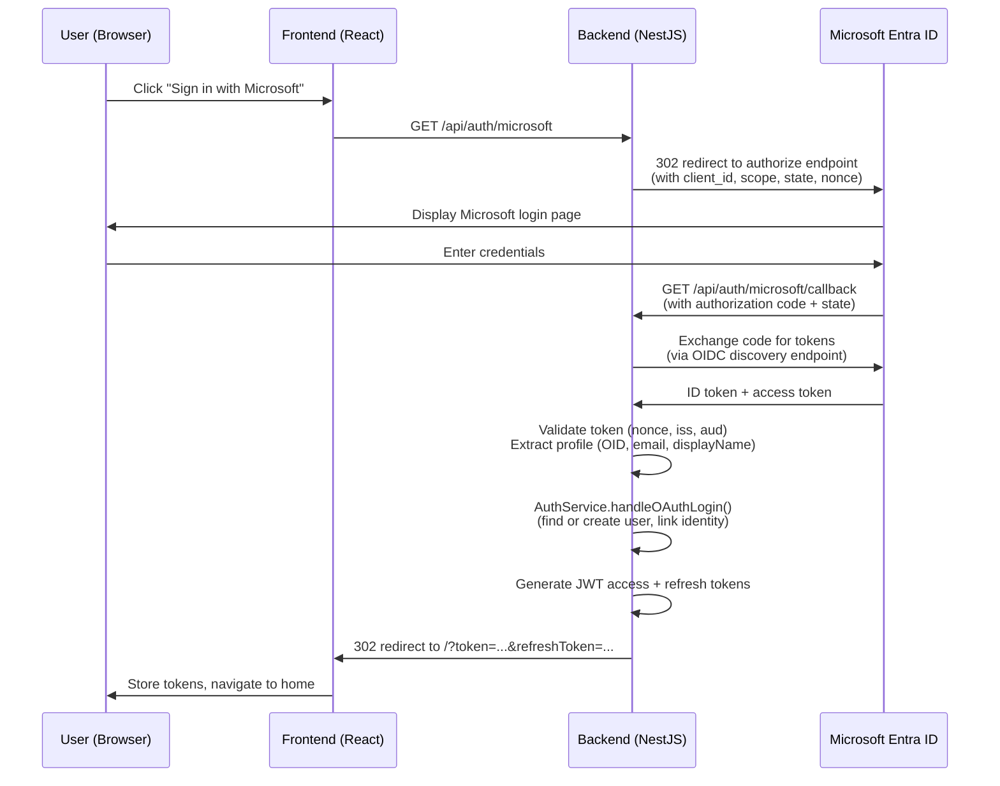

# Azure AD (Microsoft Entra ID) Authentication Specification

## Table of Contents

1. [Feature Overview](#feature-overview)
2. [Architecture](#architecture)
3. [Azure Portal Setup Guide](#azure-portal-setup-guide)
4. [API Endpoints](#api-endpoints)
5. [Tenant Configuration](#tenant-configuration)
6. [Profile Mapping](#profile-mapping)
7. [Identity Linking](#identity-linking)
8. [Security](#security)
9. [Configuration](#configuration)
10. [Troubleshooting](#troubleshooting)
11. [File Inventory](#file-inventory)

---

## Feature Overview

The Azure AD Authentication feature adds Microsoft Entra ID (formerly Azure Active Directory) as a second OAuth/OIDC identity provider alongside the existing Google OAuth integration. It enables organizations that rely on Microsoft 365, Azure, or Entra ID to authenticate users using their existing corporate credentials.

### Core Capabilities

- **Conditional activation** — the Microsoft provider is only enabled when the required environment variables are present. No configuration = no Microsoft login button.
- **OIDC Authorization Code flow** — uses `passport-azure-ad` with `OIDCStrategy`, which performs full OpenID Connect discovery and token validation.
- **Multi-tenant support** — a single configuration flag (`MICROSOFT_TENANT_ID`) controls which Microsoft accounts are permitted: single tenant, any organization, or any Microsoft account including personal.
- **Identity linking** — a user with the same email address who has previously authenticated via Google is automatically linked. No duplicate accounts are created.
- **No database schema changes** — the existing `user_identities` table stores Microsoft identities using the provider name `microsoft` and the Azure AD Object ID (OID) as the subject.

### Use Cases

1. **Enterprise organizations** — users authenticate with their corporate Microsoft 365 credentials.
2. **Mixed-provider environments** — some users use Google accounts, others use Microsoft accounts; both are supported simultaneously.
3. **Single-tenant deployments** — restrict login to a single Azure AD tenant (one organization only).
4. **Multi-tenant SaaS** — accept any Microsoft organizational account or any Microsoft account.

---

## Architecture

### System Layers

```
┌─────────────────────────────────────────────────────────────┐
│                       Frontend Layer                        │
│  React + Material UI + TypeScript                           │
│                                                             │
│  LoginPage → "Sign in with Microsoft" button                │
│  (rendered only when 'microsoft' appears in providers list) │
└────────────────────────────┬────────────────────────────────┘
                             │ HTTPS (Nginx)
                             ▼
┌─────────────────────────────────────────────────────────────┐
│                       Backend Layer                         │
│  NestJS + Fastify + TypeScript                              │
│                                                             │
│  AuthController                                             │
│    GET /api/auth/microsoft        (initiate OIDC flow)      │
│    GET /api/auth/microsoft/callback (handle callback)       │
│         ↓                                                   │
│  MicrosoftStrategy (passport-azure-ad OIDCStrategy)         │
│         ↓                                                   │
│  AuthService.handleOAuthLogin()   (shared with Google)      │
│         ↓                                                   │
│  JWT generation → redirect to frontend with tokens          │
└────────────────────────────┬────────────────────────────────┘
                             │ Prisma ORM
                             ▼
┌─────────────────────────────────────────────────────────────┐
│                      Database Layer                         │
│  PostgreSQL                                                  │
│                                                             │
│  users table (email, display name, activation)              │
│  user_identities table (provider='microsoft', subject=OID)  │
└─────────────────────────────────────────────────────────────┘
```

### OIDC Authorization Code Flow



### Comparison with Google OAuth

Both providers follow the same logical flow and reuse the same `handleOAuthLogin` service method. The key differences are:

| Aspect | Google OAuth | Microsoft OIDC |
|---|---|---|
| Passport strategy | `passport-google-oauth20` | `passport-azure-ad` OIDCStrategy |
| Protocol | OAuth 2.0 with profile API | OpenID Connect (OIDC) |
| Discovery | Static Google endpoint | OIDC discovery document per tenant |
| Subject identifier | Google user ID | Azure AD Object ID (OID) |
| Profile picture | Returned in OAuth response | Not returned via OIDC |
| Tenant support | N/A (Google accounts only) | Configurable via `MICROSOFT_TENANT_ID` |
| Env guard | `GOOGLE_CLIENT_ID` + `GOOGLE_CLIENT_SECRET` | `MICROSOFT_CLIENT_ID` + `MICROSOFT_CLIENT_SECRET` |

### handleOAuthLogin Shared Method

Both strategies converge at `AuthService.handleOAuthLogin()`, which accepts a normalized `OAuthProfile`:

```typescript
interface OAuthProfile {
  provider: string;            // 'google' | 'microsoft'
  providerSubject: string;     // unique ID from the provider
  email: string;
  providerDisplayName?: string;
  providerProfileImageUrl?: string;
}
```

The method:
1. Checks the email against the allowlist (rejects if not present)
2. Looks up an existing `UserIdentity` by `(provider, providerSubject)`
3. If not found, looks up an existing `User` by email to support identity linking
4. Creates `User` + `UserIdentity` records if the user is entirely new
5. Adds a new `UserIdentity` record if the email matches an existing user (cross-provider link)
6. Returns the user record for JWT generation

---

## Azure Portal Setup Guide

Follow these steps to register the application in the Azure Portal and obtain the credentials required by this feature.

### Step 1: Open App Registrations

1. Sign in to [portal.azure.com](https://portal.azure.com) with an account that has permission to register applications.
2. In the top search bar, type **Azure Active Directory** and select it (or search for **Microsoft Entra ID** on newer portals — they are the same service).
3. In the left navigation panel, click **App registrations**.
4. Click **+ New registration**.

### Step 2: Configure the Registration

Fill in the registration form:

| Field | Value |
|---|---|
| **Name** | Your application name (e.g., `Knecta Dev`) |
| **Supported account types** | See the [Tenant Configuration](#tenant-configuration) section below |
| **Redirect URI** | Select **Web** and enter the callback URL |

For local development, the redirect URI is:

```
http://localhost:8319/api/auth/microsoft/callback
```

For production, use your actual domain:

```
https://app.example.com/api/auth/microsoft/callback
```

Click **Register**.

### Step 3: Copy the Application (Client) ID

After registration completes you will land on the app's Overview page.

Copy the **Application (client) ID** — this is your `MICROSOFT_CLIENT_ID` value.

### Step 4: Create a Client Secret

1. In the left navigation, click **Certificates & secrets**.
2. Under the **Client secrets** tab, click **+ New client secret**.
3. Add a description (e.g., `app-secret`) and choose an expiry period.
4. Click **Add**.
5. **Copy the secret Value immediately** — it will not be shown again after you leave this page.

This value is your `MICROSOFT_CLIENT_SECRET`.

### Step 5: Verify API Permissions

1. In the left navigation, click **API permissions**.
2. Confirm the following Microsoft Graph permissions are listed (they are pre-selected by default):
   - `openid`
   - `profile`
   - `email`
3. If any are missing, click **+ Add a permission** → **Microsoft Graph** → **Delegated permissions**, and add them.
4. No admin consent is required for these basic OIDC scopes.

### Step 6: Set Environment Variables

Add the following to your `infra/compose/.env` file (see [Configuration](#configuration) for the full variable list):

```bash
MICROSOFT_CLIENT_ID=aaaabbbb-1111-2222-3333-ccccddddeeee
MICROSOFT_CLIENT_SECRET=Xx~8Q.fictionalSecretValue~AbCdEfGhIjKl
MICROSOFT_CALLBACK_URL=http://localhost:8319/api/auth/microsoft/callback
MICROSOFT_TENANT_ID=common
```

---

## API Endpoints

### GET /api/auth/microsoft

Initiates the Microsoft OIDC Authorization Code flow. The backend responds with a `302` redirect to the Microsoft login page.

**Authentication**: None required (public endpoint)

**Query parameters**: None

**Response**: `302 Found` — redirect to `https://login.microsoftonline.com/<tenant>/oauth2/v2.0/authorize?...`

**Example (browser navigation)**:

```
GET http://localhost:8319/api/auth/microsoft
```

This endpoint is intended to be triggered by browser navigation (the "Sign in with Microsoft" button), not by an API client.

---

### GET /api/auth/microsoft/callback

Handles the callback from Microsoft after the user authenticates. Microsoft posts the authorization code to this URL. The backend exchanges the code for tokens, validates the OIDC ID token, creates or links the user account, generates JWTs, and redirects to the frontend.

**Authentication**: None required (public endpoint — callback from Microsoft)

**Query parameters** (set by Microsoft):

| Parameter | Description |
|---|---|
| `code` | Authorization code to exchange for tokens |
| `state` | Opaque state value (CSRF protection, set by passport-azure-ad) |
| `session_state` | Microsoft session state |

**Success response**: `302 Found` — redirect to `/?token=<access_jwt>&refreshToken=<refresh_jwt>`

**Failure responses**:

| Scenario | Redirect |
|---|---|
| Email not in allowlist | `/login?error=not_allowed` |
| User account disabled | `/login?error=account_disabled` |
| OAuth error from Microsoft | `/login?error=oauth_error` |

---

### GET /api/auth/providers

Returns the list of currently enabled authentication providers. This endpoint is used by the frontend to decide which login buttons to render.

**Authentication**: None required (public endpoint)

**Response**:

```json
{
  "providers": ["google", "microsoft"]
}
```

When `MICROSOFT_CLIENT_ID` or `MICROSOFT_CLIENT_SECRET` is absent, `microsoft` will not appear in the list and the login button will not be rendered.

---

## Tenant Configuration

The `MICROSOFT_TENANT_ID` environment variable controls which Microsoft accounts are permitted to authenticate. This maps directly to the **Supported account types** setting in the Azure Portal app registration.

| `MICROSOFT_TENANT_ID` value | Azure Portal account type setting | Who can log in |
|---|---|---|
| `common` (default) | Accounts in any organizational directory and personal Microsoft accounts | Any Microsoft account — organizational or personal (Outlook, Hotmail, etc.) |
| `organizations` | Accounts in any organizational directory | Any Azure AD tenant (any company using Microsoft 365) |
| `consumers` | Personal Microsoft accounts only | Personal Microsoft accounts only (Outlook, Hotmail, Xbox) |
| `<tenant-guid>` | Accounts in this organizational directory only | Only users in your specific Azure AD tenant |

### Choosing the Right Tenant Mode

**Single organization (recommended for internal tools)**

Use your specific tenant GUID. Users from other organizations cannot log in.

```bash
MICROSOFT_TENANT_ID=aaaabbbb-1111-2222-3333-ccccddddeeee
```

Find your tenant GUID: Azure Portal → Azure Active Directory → Overview → **Tenant ID**.

**Any organization (multi-tenant SaaS)**

Use `organizations` to accept users from any company using Microsoft 365. You may need to go through Microsoft's multi-tenant app verification process for production use.

```bash
MICROSOFT_TENANT_ID=organizations
```

**Any Microsoft account**

Use `common` for the broadest coverage, including personal accounts. This is the default when `MICROSOFT_TENANT_ID` is not set.

```bash
MICROSOFT_TENANT_ID=common
```

**Important**: The Azure Portal app registration's **Supported account types** must be compatible with the `MICROSOFT_TENANT_ID` value. A mismatch causes `AADSTS700016` or `AADSTS50011` errors.

---

## Profile Mapping

The `passport-azure-ad` OIDCStrategy returns a profile object. The Microsoft strategy normalizes this into the internal `OAuthProfile` interface as follows:

| Azure AD / OIDC field | Internal field | Notes |
|---|---|---|
| `profile.oid` | `providerSubject` | The Azure AD Object ID — globally unique per user per tenant. Used as the stable identity key. |
| `_json.email` | `email` | Primary source. Present when the `email` scope is granted and the user has an email attribute. |
| `_json.preferred_username` | `email` | First fallback. Often a UPN (e.g., `user@company.com`) for organizational accounts. |
| `profile.upn` | `email` | Second fallback. User Principal Name from the OIDC token. |
| `profile.displayName` | `providerDisplayName` | User's display name from the directory. Falls back to the resolved email if absent. |
| N/A | `providerProfileImageUrl` | Always `undefined`. Azure AD OIDC does not return a profile picture URL in the ID token. |

### Email Resolution Logic

```typescript
const email =
  profile._json?.email ||
  profile._json?.preferred_username ||
  profile.upn;
```

If none of these fields yield a value, the strategy rejects the login and the user is redirected to `/login?error=oauth_error`. This can occur for guest accounts or accounts without email attributes configured in Azure AD.

---

## Identity Linking

Identity linking allows a user who has authenticated with one provider (e.g., Google) to subsequently authenticate with another provider (e.g., Microsoft) using the same email address. The result is a single user account linked to both identity providers.

### How It Works

The `handleOAuthLogin` method resolves the final user record through this lookup chain:

```
1. Look up UserIdentity by (provider='microsoft', subject=<OID>)
   → Found: return existing user (returning Microsoft user)

2. Look up User by email
   → Found: create new UserIdentity record linking this user to Microsoft
            (Google user logging in with Microsoft for the first time)

3. Neither found: create new User + new UserIdentity
   (brand new user, first login)
```

### Example Scenario

1. Alice logs in with her Google account (`alice@example.com`) → `User` record created, `UserIdentity(provider=google, subject=google-id-123)` created.
2. Alice logs in with her Microsoft account (same email `alice@example.com`) → existing `User` found by email → new `UserIdentity(provider=microsoft, subject=oid-abc-456)` created and linked to the same `User`.
3. Alice can now log in with either Google or Microsoft and will land on the same account.

### Constraints

- Linking is automatic and transparent — no user action is required.
- The email address is the linking key. If the email differs between providers (e.g., a personal Microsoft account with a different email), two separate user accounts will be created.
- The allowlist check applies independently on each login attempt, regardless of whether the user already has a linked identity.

---

## Security

### OIDC Protocol Security

- **Authorization Code flow** — the client never receives tokens directly from the authorization endpoint. Tokens are exchanged server-side, preventing token leakage via browser history or referrer headers.
- **State parameter** — `passport-azure-ad` generates a cryptographically random state value on each authorization request. Microsoft returns it in the callback and the strategy validates it, preventing CSRF attacks.
- **Nonce** — a nonce is embedded in the authorization request and validated in the ID token, preventing replay attacks.
- **OIDC discovery** — token validation uses the OIDC discovery document (`/.well-known/openid-configuration`) to fetch the current signing keys. This ensures tokens are always validated against Microsoft's live public keys.
- **Audience validation** — the ID token `aud` claim is validated against the configured `MICROSOFT_CLIENT_ID`. Tokens issued for other applications are rejected.

### HTTP vs HTTPS for Redirect URLs

Microsoft requires HTTPS for redirect URLs in production. During local development, HTTP is permitted. The strategy is configured conditionally:

```typescript
allowHttpForRedirectUrl: process.env.NODE_ENV !== 'production'
```

This allows local development on `http://localhost:8319` while enforcing HTTPS in production.

### Allowlist Enforcement

The email allowlist check is applied inside `handleOAuthLogin` after successful OIDC token validation, before any user record is created or a JWT is issued. This is identical to the Google OAuth flow. An email that is not on the allowlist receives a redirect to `/login?error=not_allowed` regardless of whether the Microsoft authentication itself succeeded.

### Secrets Management

- `MICROSOFT_CLIENT_SECRET` is stored only in environment variables and never committed to source control.
- The client secret is used exclusively server-side for the token exchange request. It is never exposed to the browser.
- See `.env.example` for the full list of required variables.

### Disabled User Handling

If a user account is deactivated in the application (via the admin Users panel), subsequent logins via any provider — including Microsoft — are rejected. The check occurs in `handleOAuthLogin` after the user record is retrieved and before JWT generation.

---

## Configuration

All Microsoft authentication configuration is provided through environment variables. The feature is disabled when `MICROSOFT_CLIENT_ID` or `MICROSOFT_CLIENT_SECRET` is absent — no code changes are required to enable or disable it.

| Variable | Required | Default | Description |
|---|---|---|---|
| `MICROSOFT_CLIENT_ID` | Yes* | — | The Application (client) ID from the Azure App Registration Overview page. |
| `MICROSOFT_CLIENT_SECRET` | Yes* | — | The client secret Value from Certificates & secrets. Copy immediately after creation. |
| `MICROSOFT_TENANT_ID` | No | `common` | Controls which Microsoft accounts can authenticate. See [Tenant Configuration](#tenant-configuration). |
| `MICROSOFT_CALLBACK_URL` | Yes* | — | The full callback URL registered in the Azure Portal. Must match exactly, including protocol and path. |

*Required only when Microsoft authentication is desired. Omitting `MICROSOFT_CLIENT_ID` or `MICROSOFT_CLIENT_SECRET` disables the provider entirely.

### Example `.env` Configuration

**Local development (any Microsoft account)**:

```bash
MICROSOFT_CLIENT_ID=aaaabbbb-1111-2222-3333-ccccddddeeee
MICROSOFT_CLIENT_SECRET=Xx~8Q.fictionalSecretValue~AbCdEfGhIjKl
MICROSOFT_CALLBACK_URL=http://localhost:8319/api/auth/microsoft/callback
MICROSOFT_TENANT_ID=common
```

**Production (single organization)**:

```bash
MICROSOFT_CLIENT_ID=aaaabbbb-1111-2222-3333-ccccddddeeee
MICROSOFT_CLIENT_SECRET=Xx~8Q.fictionalSecretValue~AbCdEfGhIjKl
MICROSOFT_CALLBACK_URL=https://app.example.com/api/auth/microsoft/callback
MICROSOFT_TENANT_ID=ffffeee0-5555-6666-7777-888899990000
```

**Disabled (no variables set)**:

```bash
# Microsoft auth is disabled — login page shows Google only
# MICROSOFT_CLIENT_ID=
# MICROSOFT_CLIENT_SECRET=
# MICROSOFT_CALLBACK_URL=
# MICROSOFT_TENANT_ID=
```

---

## Troubleshooting

### AADSTS50011 — Reply URL Mismatch

**Error message**: `The reply URL specified in the request does not match the reply URLs configured for the application.`

**Cause**: The `MICROSOFT_CALLBACK_URL` value does not exactly match one of the redirect URIs registered in the Azure Portal.

**Resolution**:
1. Open Azure Portal → App registrations → your app → Authentication.
2. Under **Redirect URIs**, confirm the exact URI is listed (including `http` vs `https`, trailing slashes, and the full path `/api/auth/microsoft/callback`).
3. Ensure `MICROSOFT_CALLBACK_URL` in your `.env` matches exactly.

---

### AADSTS700016 — Application Not Found in Tenant

**Error message**: `Application with identifier '...' was not found in the directory '...'.`

**Cause**: Either `MICROSOFT_CLIENT_ID` is wrong, or `MICROSOFT_TENANT_ID` refers to a tenant where the app is not registered.

**Resolution**:
1. Verify `MICROSOFT_CLIENT_ID` matches the **Application (client) ID** on the app's Overview page.
2. Verify `MICROSOFT_TENANT_ID` is appropriate for the app registration's **Supported account types** (see [Tenant Configuration](#tenant-configuration)).
3. If using a specific tenant GUID, confirm you are using the **Tenant ID**, not the tenant domain or any other GUID.

---

### No Email in Profile

**Symptom**: Login fails with `oauth_error`. Backend logs show `email is undefined` or similar.

**Cause**: The authenticated Microsoft account does not have the `email` attribute populated in Azure AD, or the user is a guest account without an email claim.

**Resolution**:
1. In Azure AD, verify the user's **Email** attribute is set (Azure AD → Users → the user → Profile → Contact info → Email).
2. For guest accounts, check whether the `email` claim is included in the ID token for your tenant configuration.
3. Ensure the `email` scope is listed in the app's API permissions.

---

### HTTP Redirect Not Allowed in Production

**Symptom**: Login fails in production with an error about insecure redirect URIs.

**Cause**: Microsoft requires HTTPS for redirect URIs in production app registrations.

**Resolution**:
1. Register an HTTPS redirect URI in the Azure Portal (e.g., `https://app.example.com/api/auth/microsoft/callback`).
2. Set `MICROSOFT_CALLBACK_URL` to the HTTPS URL.
3. The `allowHttpForRedirectUrl` flag is automatically set to `false` when `NODE_ENV=production`, so no code change is needed.

---

### Login Button Not Visible

**Symptom**: The "Sign in with Microsoft" button does not appear on the login page.

**Cause**: One or both of `MICROSOFT_CLIENT_ID` and `MICROSOFT_CLIENT_SECRET` are not set in the environment.

**Resolution**:
1. Verify both variables are present in `infra/compose/.env`.
2. Restart the API container so the new environment variables are loaded.
3. Confirm `GET /api/auth/providers` returns `"microsoft"` in the providers array.

---

### Token Exchange Fails (500 Internal Server Error)

**Symptom**: The callback URL is reached but the backend returns a 500 error. Logs show a token exchange or validation failure.

**Cause**: Possible causes include an expired or deleted client secret, a clock skew between the server and Microsoft, or a misconfigured tenant.

**Resolution**:
1. Verify the client secret has not expired (Azure Portal → Certificates & secrets → check the **Expires** column).
2. Ensure the server's system clock is accurate (NTP synchronized).
3. Check backend logs for the specific error message from `passport-azure-ad`.

---

## File Inventory

### New Files

| File | Description |
|---|---|
| `apps/api/src/auth/strategies/microsoft.strategy.ts` | Passport `OIDCStrategy` implementation. Reads env vars, builds strategy options, normalizes the Azure AD profile into `OAuthProfile`, delegates to `AuthService.handleOAuthLogin`. Conditionally instantiated only when env vars are present. |
| `docs/specs/AZURE-AD-AUTH.md` | This specification document. |

### Modified Files

| File | Change Description |
|---|---|
| `apps/api/src/auth/auth.controller.ts` | Added `GET /auth/microsoft` and `GET /auth/microsoft/callback` route handlers with `@UseGuards(MicrosoftAuthGuard)`. |
| `apps/api/src/auth/auth.module.ts` | Registered `MicrosoftStrategy` in the `providers` array (conditionally, based on env var presence). |
| `apps/api/src/auth/auth.service.ts` | The existing `handleOAuthLogin` method required no changes — it accepts any provider string and profile. |
| `apps/api/src/auth/guards/microsoft-auth.guard.ts` | New guard wrapping `passport-azure-ad` authenticate call for the Microsoft OIDC strategy. |
| `apps/web/src/pages/LoginPage.tsx` | Renders the "Sign in with Microsoft" button when `microsoft` appears in the providers list from `GET /api/auth/providers`. |
| `apps/api/package.json` | Added `passport-azure-ad` dependency. |
| `infra/compose/.env.example` | Added `MICROSOFT_CLIENT_ID`, `MICROSOFT_CLIENT_SECRET`, `MICROSOFT_CALLBACK_URL`, and `MICROSOFT_TENANT_ID` entries (commented out). |
